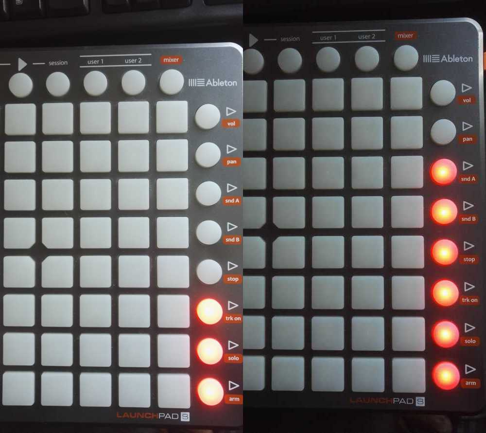

# Launchpad mixer - Linux only
Change the current master volume of your system using your Novation Launchpad. Tested with LaunchPad S only.

# How to compile
To compile simply launch `make`

# How to run
Launch `./launchpad-mixer` and then choose the correct MIDI port of your Novation Launchpad.

# External libraries
[RtMidi](https://github.com/thestk/rtmidi) 
[Alsa](https://www.alsa-project.org/main/index.php/Main_Pag)